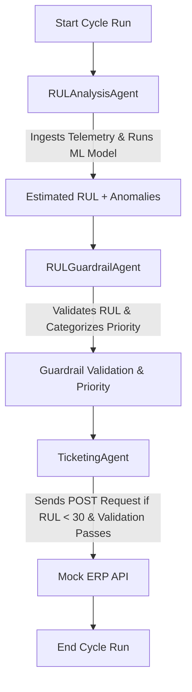

# Fleet Maintenance Orchestrator

An automated maintenance forecasting and AOG (Aircraft on Ground) ticketing system built using **Google's Agent Development Kit (ADK 2.0)** and leveraging **NASA's CMAPSS turbofan engine dataset**. 

The system uses a multi-agent orchestration architecture to predict the Remaining Useful Life (RUL) of aircraft engines, validate predictive results against safety control limits, and automatically log maintenance actions in an ERP system while preventing duplicate alerts.

---

## 🛠️ Multi-Agent Architecture

The orchestration workflow is managed sequentially by three cooperative LLM-based agents powered by `gemini-2.5-flash`:



1. **RULAnalysisAgent (`RULAnalysisAgent`)**
   - **Role**: Ingests telemetry data for a specific cycle and executes tools to predict engine degradation.
   - **Tools**: 
     - `read_telemetry`: Extracts cycle telemetry data (operational settings and key sensors).
     - `calculate_rul`: Runs a trained `scikit-learn` model (`models/rul_model.pkl`) to predict the engine's remaining cycles.
     - `check_baselines`: Detects sensor anomalies by comparing values against defined upper and lower control limits (LCL/UCL).
   - **Output**: Synthesized JSON payload containing the engine state and estimated RUL.

2. **RULGuardrailAgent (`RULGuardrailAgent`)**
   - **Role**: Performs safety and logic validation on the RUL prediction.
   - **Validation Criteria**:
     - Ensures predicted RUL is within a realistic bounds ($0 - 200$ cycles).
     - Cross-checks for logical consistency (e.g., if predicted RUL is below 30 cycles, at least one sensor must show anomalous behavior).
     - Assigns a priority tier: `CRITICAL` (RUL < 15), `HIGH` (15-29), `MEDIUM` (30-49), or `LOW` (RUL $\ge$ 50).
   - **Output**: JSON payload with validation status, priority level, and detailed reasoning.

3. **TicketingAgent (`TicketingAgent`)**
   - **Role**: Handles communication with the ERP backend.
   - **Logic**:
     - Skips ticket creation if the guardrail validation fails.
     - Automatically invokes the `submit_ticket` tool if validation passes and estimated RUL is below **30 cycles**.
     - Checks active local records (`data/active_tickets.json`) to prevent duplicate submissions for the same engine.
   - **Output**: Final summary of actions, including ticket tracking IDs and priority levels.

---

## 📁 Project Directory Structure

```text
fleet_maintenance_orchestrator/
│
├── data/
│   ├── active_tickets.json       # Tracks currently open tickets to prevent duplicates
│   ├── erp_api_schema.json       # API specifications for the mock ERP server
│   ├── sensor_baselines.json     # Normal range limits (LCL/UCL) for sensors
│   └── telemetry_TF804.csv       # NASA CMAPSS telemetry dataset for engine TF-804
│
├── fleet_agents/
│   ├── __init__.py
│   ├── agent.py                  # Orchestrator app & SequentialAgent configuration
│   ├── rul_agent.py              # Ingestion, prediction, and anomaly detection agent
│   ├── guardrail_agent.py        # Logic and priority validation agent
│   ├── ticketing_agent.py        # Ticket automation and duplicate checking agent
│   └── tools/
│       ├── __init__.py
│       ├── calculate_rul.py      # Executes ML prediction using scikit-learn
│       ├── check_baselines.py    # Cross-references telemetry against sensor limits
│       ├── read_telemetry.py     # Accesses NASA CMAPSS dataset rows
│       └── submit_ticket.py      # Requests ticket creation from mock ERP system
│
├── mock_erp_server/
│   ├── server.py                 # FastAPI-based mock ERP REST API server
│   └── tickets_db.json           # Database storing mock ticket creations
│
├── models/
│   └── rul_model.pkl             # Trained predictive model for Remaining Useful Life (RUL)
│
├── scripts/
│   ├── generate_synthetic_data.py # Helper script to generate baselines & CSV data
│   ├── run_scenarios_mocked.py   # Mocks agent responses to test scenarios
│   └── train_rul_model.py        # Trains and pickles the ML model
│
├── tests/
│   ├── test_agents.py            # Active tests for the agent framework
│   ├── test_agents_mocked.py     # Mocked test flows for validation checks
│   └── test_tools.py             # Unit tests for the agent tools
│
├── .gitignore                    # Excludes venv, large models, keys, and temp DBs
├── requirements.txt              # Project package dependencies
└── run_orchestrator.py           # Orchestrator execution script
```

---

## ⚙️ Setup Instructions

### 1. Clone & Navigate
Ensure you are in the project folder:
```bash
cd fleet_maintenance_orchestrator
```

### 2. Set Up Virtual Environment
Create and activate a python virtual environment:
```bash
# Windows (PowerShell)
python -m venv venv
.\venv\Scripts\Activate.ps1

# macOS/Linux
python3 -m venv venv
source venv/bin/activate
```

### 3. Install Dependencies
Install all required libraries using the local `requirements.txt`:
```bash
pip install -r requirements.txt
```

### 4. Configuration
Create a `.env` file in the root directory and add your Google Gemini API key:
```env
GEMINI_API_KEY=your_gemini_api_key_here
```

---

## 🚀 Execution Instructions

### Run Mock ERP Server
Start the FastAPI local server to simulate the ERP system backend. Leave this running in a separate terminal:
```bash
python mock_erp_server/server.py
```
*The server will run at `http://127.0.0.1:8080`.*

### Run Orchestrator
Execute a live lifecycle analysis run by supplying a specific cycle number (1 to 50) as an argument:
```bash
# Check cycle 38 (degraded state, triggers ticket)
python run_orchestrator.py 38

# Check cycle 10 (nominal state, skips ticket)
python run_orchestrator.py 10
```

### Run Mock Scenarios (Without API Key)
To run pre-scripted agent execution scenarios (nominal, critical first-alert, and duplicate prevention) using mocked Gemini model responses:
```bash
python scripts/run_scenarios_mocked.py
```

### Run Tests
To execute unit and integration tests:
```bash
pytest tests/
```
